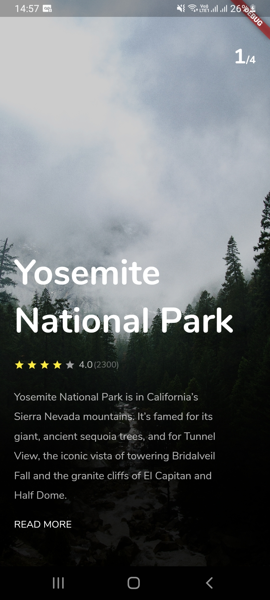
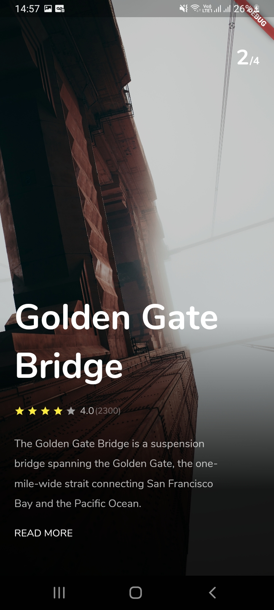
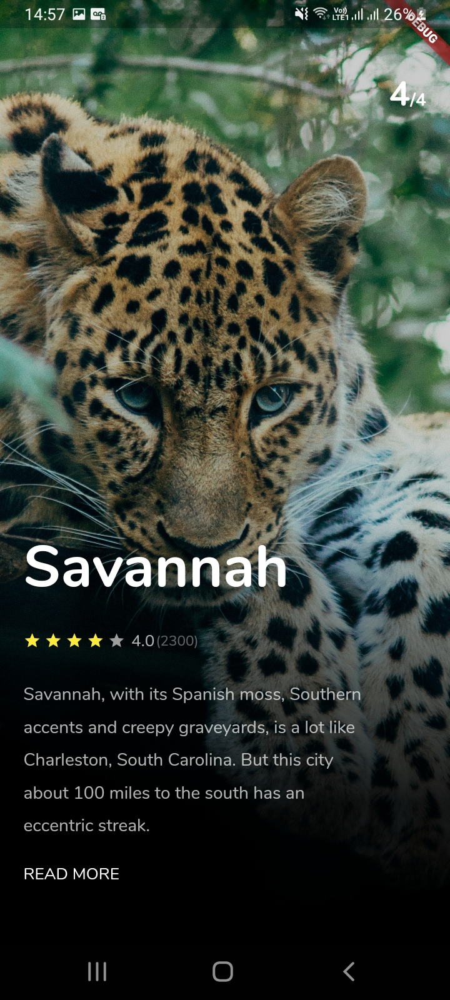

<h1 align="center">
 " Trip Aplication "
</h1>

 

<h1 align="center">
    
    
    
</h1>

## 💻 Projeto

Aplicação criada a partir do [tutorial](https://www.youtube.com/watch?v=uqm6U5_bcH0&list=PLf-j0Hs0PF3uxzMCFLlfJ9W3hRxLzHPGX&index=2), disponível no canal [Afgprogrammer](https://www.youtube.com/Afgprogrammer). 

## 🚀 Tecnologia ultilizada

- Aplicação criada com **[Flutter](https://flutter.dev/)**.
